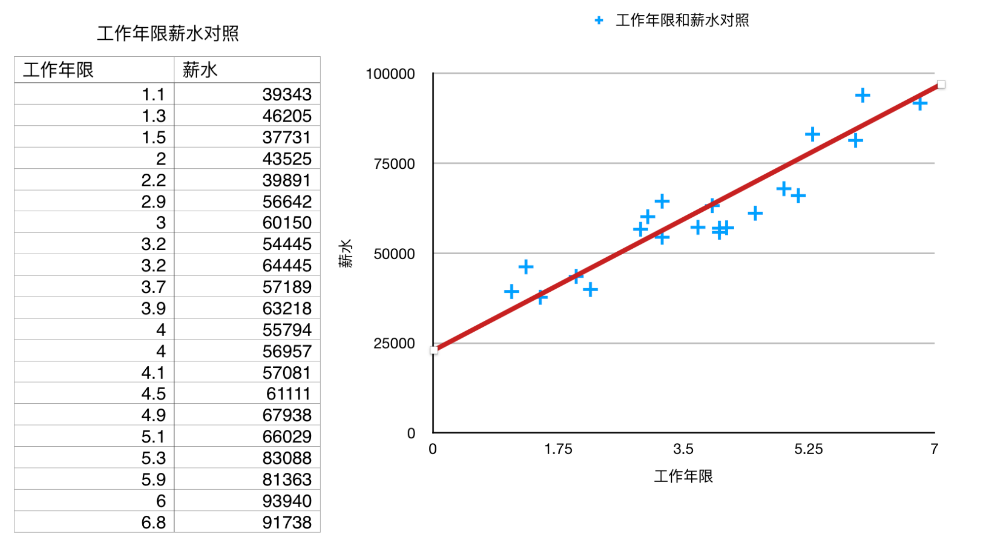
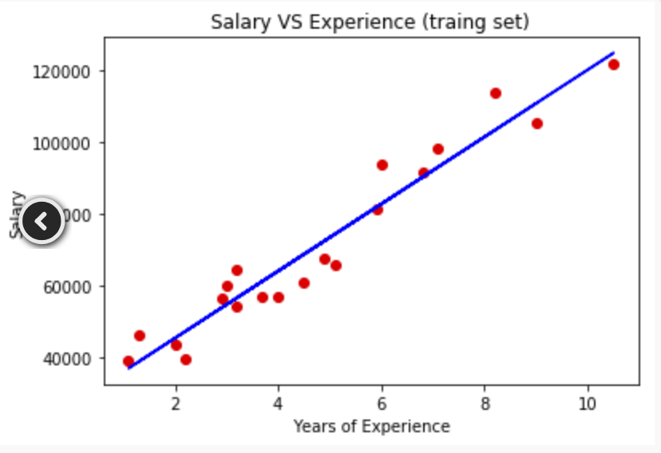
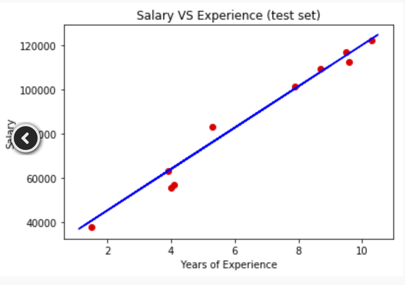

# 机器学习

> 作者：刘麟
>
> 时间：2018年7月17日

------

## 1 一元线性回归

一元线性回归只有一个自变量，一个因变量,其数学核心表达式为 ：
$$
y_0=b_0+b_1*x_1
$$
其中x为自变量，y为因变量，$b_0$为y轴的截距，代表当x=0时y的值，$b_1$为斜率代表自变量单位距离的变化所影响因变量的变化。


在进行机器学习前，我们首先需要做数据准备。比如有100条数据，我们首先要对这些数据进行分类，一部分作为构建模型用，称为训练集；一部分用来检测我们的结果是否正确，称为训练集。训练集和测试集的比率通常为8-2，7-3。



如图所示，我们的x轴代表了工作的年限，y轴代表了薪水，通过散点图可以看出x和y确实存在某种线性关系。因此我们就可以使用一元线性回归来解决我们的这个问题，那我们要做什么呢？就是要通过这些数据构建出红色的那条线，这就是机器学习的模型。有了这个模型之后，比如新来一个员工，我们就可以使用这个模型来预测该员工再某工作年限所得得薪水是多少。

知道了我们要做的事以后，我们所面对的第一个问题就是如何构建这条红色线段，通常会使用到数学中的[最小二乘法](https://baike.baidu.com/item/%E6%9C%80%E5%B0%8F%E4%BA%8C%E4%B9%98%E6%B3%95/2522346?fr=aladdin)，本文不对最小二乘法的数学定义讨论，幸运的是通过使用python机器学习的库，我们可以直接调用线性回归的相关函数。


下面是具体代码

```python
# 第一步 导入标准的库函数
import numpy as np
import matplotlib.pyplot as plt
import pandas as pd

# 第二步 构建数据集

dataset = pd.read_csv('Salary_Data.csv') #从文件中读取数据到dataset变量中

X = dataset.iloc[:,:-1].values #设置自变量
Y = dataset.iloc[:,1].values   #设定因变量


# 第三步 将数据分割成训练集和测试集
from sklearn.model_selection import train_test_split 
X_train,X_test,Y_train,Y_test = train_test_split(X,Y,test_size=1/3,random_state=0) #生成训练集和测试集


# 第四步 拟合线性回归模型
from sklearn.linear_model import LinearRegression #从python机器学习的库中导入线性回归函数
regressor = LinearRegression()
regressor.fit(X_train,Y_train) #用训练集中的数据，拟合模型


# 第五步 预测
y_pred = regressor.predict(X_test) #根据测试机通过模型进行预测

# 第六步 画图-训练集
plt.scatter(X_train,Y_train,color='red') #用测试集画点
plt.plot(X_train,regressor.predict(X_train),color='blue') #用测试集画线
plt.title('Salary VS Experience (traing set)') #设置标题
plt.xlabel('Years of Experience') #设置X坐标
plt.ylabel('Salary') #设置Y坐标
plt.show() #图表展示


# 画图 -测试集合
plt.scatter(X_test,Y_test,color='red') #用训练集画点
plt.plot(X_train,regressor.predict(X_train),color='blue') #模型
plt.title('Salary VS Experience (test set)') 
plt.xlabel('Years of Experience')
plt.ylabel('Salary')
plt.show()
```



上图是根据训练集拟合出来的一元线性回归方程



上图是根据测试集对拟合出来的一元线性回归方程进行预测，可以看出在一定程度上还是比较准确的。

## 2 多元线性回归

> 时间：2018年7月17日

------

### 2.1 问题

50家创业公司投入

| 研发成本  | 管理成本  | 市场成本  | 州         | 利润      |
| --------- | --------- | --------- | ---------- | --------- |
| 165349.2  | 136897.8  | 471784.1  | New York   | 192261.83 |
| 162597.7  | 151377.59 | 443898.53 | California | 191792.06 |
| 153441.51 | 101145.55 | 407934.54 | Florida    | 191050.39 |
| 144372.41 | 118671.85 | 383199.62 | New York   | 182901.99 |
| 142107.34 | 91391.77  | 366168.42 | Florida    | 166187.94 |
| ...       | ...       | ...       | ...        | ...       |

实际问题：比如我们是一家投资公司，我们的任务就是对这些创业公司进行投资评估，选择出哪些公司未来可能的效益会最好，那我们就要根据研发成本、管理成本、市场成本、地理位置等因素，来预测哪个公司会获得最佳的盈利

在这里**研发成本、管理成本、市场成本、地理位置**是自变量，利润是**因变量**，这个问题就需要使用多元线性回归来解决。

### 2.2 数学定义

这个问题就要比之前的一元线性回归复杂的多，我们很难通过肉眼判断出变量之前的关系。

多元线性回归与一元线性回归相比有多个自变量，一个因变量,其数学核心表达式为 ：
$$
y=b_0+b_1*x_1+b_2*x_2+...+b_n*x_n
$$
其中，$x_1,x_2…x_n$为自变量，y为因变量，$b_0$为常量。

### 2.3 假定条件

线性回归成立要满足以下五个前提条件

- 线性
- 同方差性
- 多元正太分布
- 误差独立
- 无多重共线性

### 2.4 虚拟变量

| 利润      | 研发=x1   | 管理=x2   | 市场=x3   | 位置=x4    |
| --------- | --------- | --------- | --------- | ---------- |
| 191792.06 | 162597.7  | 151377.59 | 443898.53 | California |
| 191050.39 | 153441.51 | 101145.55 | 407934.54 | New York   |
| 182901.99 | 144372.41 | 118671.85 | 383199.62 | New York   |
| 166187.94 | 142107.34 | 91391.77  | 366168.42 | California |

$$
y=b0+b_1*x_1+b_2*x_2+b_3*x_3+???
$$

以上位置变量=$x_4$，但$x_4$与其它变量不同，它不是线性关系，是一种分离关系

| 位置=x4    |
| ---------- |
| California |
| New York   |
| New York   |
| California |

对于上面这种分类变量，需要使用虚拟变量解决，对应每一种类别新增一列表示该列是否存在，比如上面$x_4$有两个列别，那我们就新增两列没一列代表类别中的某项是否存在

| New York | California |
| -------- | ---------- |
| 0        | 1          |
| 1        | 0          |
| 1        | 0          |
| 0        | 1          |

那我们将整个这组新的变量称之为虚拟变量，用$D_1$表示，那最后我们的多元方程如下所示：
$$
y=b0+b_1*x_1+b_2*x_2+b_3*x_3+b_4*D_1
$$
同时我们可以得到如下结论：`虚拟变量的列数=分类总数-1`

### 2.5 模型构建过程

在解决实际问题的过程中，可能会存在多个自变量，那么问题来了，我们如何选择自变量，有些自变量与我们最终的因变量可能并没有相关性，但问题是我们在一开始无法确定。

- 如果我们投入的自变量是垃圾变量，那对最后的模型是没有帮助的
- 模型要简单、准确、有效，知道因变量跟哪几个自变量相关

常见的简历模型的方式大约有五种：全部选择、反向淘汰、顺向淘汰、双向淘汰、信息量比较

#### 2.5.1 反向淘汰

1. 选择模型的标准[P值=0.05（参见网易云课堂统计学关于P值的解释）](https://open.163.com/movie/2011/6/O/I/M82IC6GQU_M83JCBUOI.html)，它是一种判断自变量对于整个模型影响力的指标。
2. 选择全部变量拟合模型
3. 对于该模型计算每一个变量的P值，如果P值大于我们设定的标准值，到第四步，否则结束
4. 移除该变量
5. 重新拟合模型，跳转到第三步

#### 2.5.2 其它模型

...

### 2.6 实践


